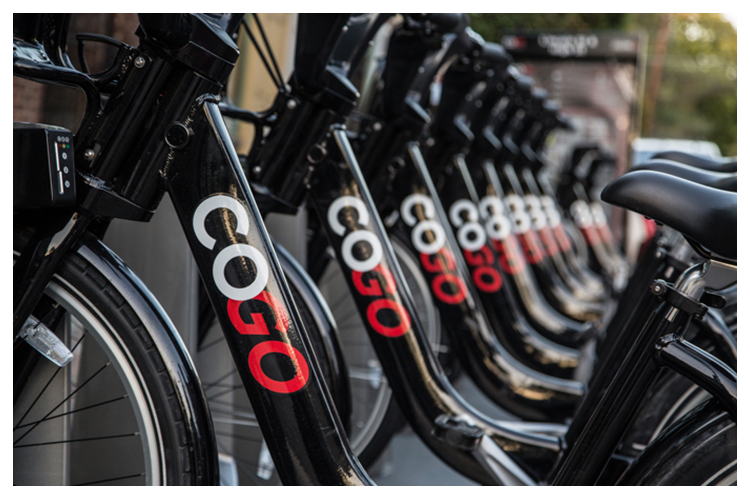
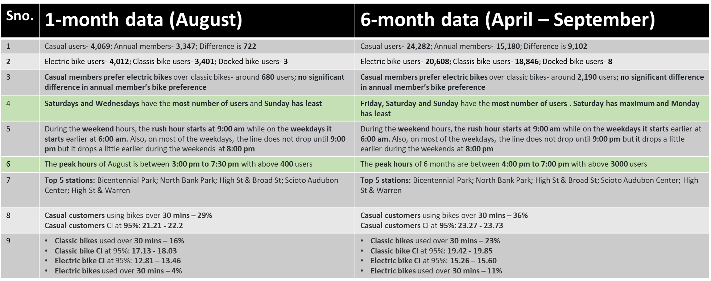
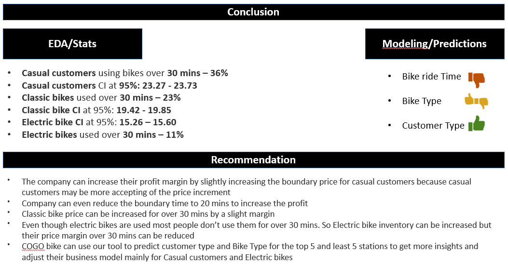

```{r, include=FALSE, echo=FALSE}

knitr::opts_chunk$set(echo = TRUE)
knitr::opts_chunk$set(error = TRUE)
library(purrr)   #to join all files
library(lubridate)# for duration of time
library(ModelMetrics)
library(pROC)
library(dplyr)
library(tidyr)
library(caret)
library(ggplot2)
library(ezids)
library(class)
library(gmodels)
library(FNN)

```



# Why Bike sharing system?

While this system has many benefits, it also presents operators with a
number of challenges, such as the best way to estimate demand. The data
contains multiple features to explore which helped us to learn about the
business and how to use analytics for the same.

# Problem statement

How can CoGo bike-sharing company boost their profit margins by
implementing particular adjustments, such as increasing or removing
specific bike kinds, growing its business in a specific location, or
lowering or raising the cost of bike share?

```{r, results='markup'}

#binding all the files in this path together
file.list <- list.files(pattern='*.csv')

file.list <- setNames(file.list, file.list)

bike <-map_df(file.list, function(x) read.csv(x))


```

# Source of dataset and observation

We found the data on CoGo website. They have made the CoGo's trip data
available for public use. The dataset is real-time data with
`r length(bike)` columns and `r nrow(bike)` rows covering 6 months of
data (Quarter 2 and Quarter 3) [Not covering the entire year due to the
large size of the data].

```{r, results='markup'}

str(bike)

```

# Features in the dataset

Below are all the column names of the dataset

```{r, results='markup'}

colnames(bike)

```

# SMART question and how did they come up?

**For Part-1** **(Exploratory data analysis)** How can the CoGo
bike-sharing company boost their profit margins by implementing
particular adjustments, such as increasing or removing specific bike
kinds, growing its business in a specific location, or lowering or
raising the cost of bike share?

**For Part-2 (Model Building Techniques)**

1.  How much time will the customer (Annual membership or Casual) ride
    the bike if travelling from a certain station to another or using a
    certain bike etc?

2.  Which Bike type (Electric or Manual) will the customer (Annual
    membership or Casual) use if travelling from a certain station to
    another/while using a certain bike type or during certain
    time-interval etc?

3.  What type of customer (Annual membership or Casual) will travel from
    a certain station to another, while using a certain bike type, or
    traveling from a certain station etc?

We mainly want to predict Customer Type, Bike Type and Ride time using
multiple features available in the data. COGO company can use these
prediction models to understand their customer behavior and can tweak
their business model from the information to gain more profit.

We found a lot of analytics being performed on the bike sharing data on
internet, but in all the analysis focus was just on the data. We also
wanted to include the business perspective and wanted to see how this
can finally help the company and hence we thought of the above-mentioned
SMART questions.

# Project 1 (EDA) - revisit

In project-1 (EDA), we only used 1 month of data (August 2022), but in
project-2 we are using 6 months of the data. We re-performed the EDA
with the similar code as last time but with 6 months of data and
compared the results of both 1 month and 6 month data



We only found major changes in point 4 and point 6 (highlighted in the
above table)

# Data Pre-Processing:

## Balancing the data

Data contains 3 types of bikes- Classic, Electric and Docked. We are
removing docked bike from the data to balance the data as the data
contains only 8 docked bikes over 39000+ observations.

```{r, results='markup'}

#Plot
bike %>% count(rideable_type)
ggplot(bike, aes(rideable_type, fill = rideable_type))+
  geom_bar()+
  scale_fill_brewer(palette = "BuPu")+
  guides(fill="none")+
  labs(title = "User bike types", x= "bike types")+
  theme_classic()

#Remove docked bikes and summary
bike <-subset(bike, rideable_type != "docked_bike")

#Plot
bike %>% count(rideable_type)
ggplot(bike, aes(rideable_type, fill = rideable_type))+
  geom_bar()+
  scale_fill_brewer(palette = "BuPu")+
  guides(fill="none")+
  labs(title = "User bike types", x= "bike types")+
  theme_classic()

```

## Data type conversion

We converted categorical variables into factor and features containing
time information into date-time format and further dates into minutes as
numeric format for specific features as we would need them in the
models.

```{r, results='markup'}
bike$rideable_type <- factor(ifelse(bike$rideable_type=="classic_bike",0,1))
bike$start_station_id <- factor(bike$start_station_id)
bike$end_station_id <- factor(bike$end_station_id)
bike$member_casual<-factor(ifelse(bike$member_casual=='casual',0,1))

bike$start_time <- format(as.POSIXct(bike$started_at), format = "%H:%M")
bike$end_time <- format(as.POSIXct(bike$ended_at), format = "%H:%M") 

#Converting time in minutes
res <- hm(bike$start_time)# format to 'hours:minutes'
bike$startingm <- hour(res)*60 + minute(res)
res <- hm(bike$end_time)# format to 'hours:minutes'
bike$endingm <- hour(res)*60 + minute(res)

str(bike)

```

## Adding new features

We created three new columns:

1.  **'Total time'** by calculating the difference between started and
    ended time, which represents the total riding time for each
    customers

2.  **'Days'** by extracting the day from the date, which has 7
    categories from Monday to Sunday

3.  **'Time range'** the variable for starting time is describing the
    specific time, which is time series. Thus, we can't just convert
    this variable into factor type, or it will have thousands of
    categories, which will be useless for our analysis and may cause
    over fitting easily. However, we can divide/categorize these
    specific time into 4 time intervals, which are Before_Dawn
    (00:00-06:00), Morning (06:00-13:00), Afternoon (13:00-18:00), and
    Night (18:00-00:00).

```{r, results='markup'}
# Fixing the date format to get the time difference
bike$Startedat = as.POSIXct(bike$started_at, format = "%Y-%m-%d %H:%M:%S")
bike$enddat = as.POSIXct(bike$ended_at, format = "%Y-%m-%d %H:%M:%S")

#Calculating the time difference 
bike$Total_Time <- abs(as.numeric(difftime(bike$enddat, bike$Startedat, units = "mins")))

#days
bike$start_date <- as.Date(bike$started_at)
bike$end_date <- as.Date(bike$ended_at)
bike$days <- factor(format(bike$start_date, format = "%a"))

#Time-range
# Extract the 'Hours' only first, then change it to numeric variable
bike$start_hour <- format(as.POSIXct(bike$started_at), format = "%H")
bike$start_hour <- as.numeric(bike$start_hour)
# Use 'summary(bike$start_hour_num)' to check if the min and max are 0 and 23

# Divide the time into different categories/intervals
bike$Time_range <- cut(bike$start_hour, c(0, 6, 12, 18, 23), c("Before dawn", "Morning", "Afternoon", "Night"), include.lowest=TRUE)
#0am-6am : Morning (Factor 1)
#6am-12pm : Morning (Factor 2)
#12pm-18pm : Afternoon (Factor 3)
#6pm-0am : Night (Factor 4)

str(bike)

```

## Feature selection

Selecting the features needed for the model

```{r, results='markup'}

#selecting the features needed for the model
selected_features <- c('member_casual','rideable_type', 'Total_Time', 'start_station_id', 'end_station_id', 'startingm','endingm','days', 'start_hour', 'Time_range')

bike2 <- bike[,(names(bike) %in% selected_features)]

str(bike2)

```

## Removing Null values and outliers

Removing outliers from column 'Total_Time'

```{r, results='markup'}

#Removing NA values
bike2<-na.omit(bike2)

#Removing outliers from Total_Time
bike2 <- outlierKD2(bike2, Total_Time, rm=T, boxplt = TRUE, qqplt = TRUE)
print('Summary Statistic for Total time')
summary(bike2)

```

# SMART Questions 1.

How much time will the customer (Annual membership or Casual) ride the
bike if travelling from a certain station to another or using a certain
bike etc?

## Objective

We are going to use the newly created variable 'Total_Time' and want to
make a fitted and predictive model for the customer's riding time. This
is because: 1). As we said before, COGO's sharing bike price is defined
by the riding time instead of riding distance. 2). If we can get some
information from the model about what factors can affect customer's
riding time and how did they affect, for example, which customer type
has more impact on the riding time, or, which bike type has more impact
on the riding time.....etc. 3). Then, base on the pattern of factors
affecting riding time from our model, we can make some recommendations
for the company's profit margin. 4). Moreover, if we can predict each
customers riding time by the given information, then the company will
know which customers will ride more and which customers will ride less,
and they can do some other analysis about those customers whose gonna
ride more in the future and use more marketing resources on them for
making them into potential long-term loyal customers.

## Model structure

Because we want to predict the customer's riding (in minutes), which is
corresponding to the 'Total_Time' variable in the dataset, and it's an
numerical data, so Linear-Regression model become our first choice. We
don't want to try Regression Tree at first because it always have the
problem of overfitting, accompany with the riding data is always
changing and it changes fast (maybe have multiple new records of ride in
next minutes), so we don't want use a model that is easily overffiting.
After we confirm which type of model we use, we will decide the
dependent (response) variable and independent (regressors) variable of
the model：We said the response variable is 'Total_Time' above and its
numerical variable. Then, for choosing regressors, the variable we
choose for LM here is almost the same, which are variables:
'rideable_type' that represents the which bike type the customer used,
'member_casual' that represents the customer's membership status, and
'days' that represents what day did that customer use that bike; Except
these variables above, for predicting the riding time, we believe the
rider's starting time will also affected the riding time, so we also
added 'start_hour' variable into our model. For example, if I am
starting at night, I may not want to spend so much time outside because
it maybe unsafe, but if I am starting at afternoon, then maybe I will
spend more time on sightseeing or something like that and won't concern
about the safety problem Then, we build our linear model based on this
structure, and below is the fitting summary and the residual plots of
this model.

```{r}
bike_lm <- data.frame(bike2)

bike_lm1 <- lm(formula = Total_Time ~ start_hour+rideable_type+member_casual+days, data=bike_lm)
summary(bike_lm1)
plot(bike_lm1)
```

According to the fitting summary, though we have some significance
coefficients and significant F-Statistic, the model fitting is really
bad, because of the low R-Squared value. We only have 4% variation of
response can be explained by our regressors, which indicate our response
is hardly explained by the regressors currently. Moreover, according to
the residual plots, we can clealy see that it's not randomly scattered
but with pattern.

## Model Assumptions Checking & Model Improvement:

Because these fitting information are really bad, we are trying to find
the reason behind this before we make the conclusion by checking the
model assumptions, and also try do something to see if we can improve
this model:

### Multicollinearity check:

```{r}
library(car)
vif(bike_lm1)
```

Firstly, we check the vifs values to make sure all the regressors are
independent with each other. As we see above, all the VIFs are less than
5, which means our regressors are midly correlate and this is
acceptable, so we can conclude our current model doesn't have the
problem of multicollinearity.

### Normally Shaped check:

We need to make sure the dependent variable is (approximate) normal
distributed. We can check the distribution of our response 'Total_Time'
by building the its histogram

```{r}

# Double check the Total_Time distribution
ggplot(data=bike_lm, mapping = aes(Total_Time))+geom_histogram(col='red', fill='blue')+labs(title='Histogram for total riding time')
```

According to the distribution above, it's highly right skewed and we
can't use the variable with this distribution to build the linear
regression. This may be a reason that we get a so bad fittings. Thus, we
will try to exclude all the outliers and build the regression again to
see if we can improve the model's fitting.

```{r}

library(ezids)

bike_clean <- outlierKD2 (bike_lm, Total_Time, rm=T, boxplt = TRUE, qqplt = TRUE)
print('Summary Statistic for cleaned membership time')
summary(bike_lm$Total_Time)

# Double check the distribution 
# ggplot(data=bike_clean, mapping = aes(Total_Time))+geom_histogram(col='red', fill='blue')+labs(title='Histogram for total riding time')
```

Above we can see now the Total_Time's distribution is approximate
normal, which is much better than before, and we can use it to build the
linear model again.

```{r}
bike_lm2 <- lm(formula = Total_Time ~ (start_hour+rideable_type+member_casual+days)^2, data=bike_clean)
summary(bike_lm2)
plot(bike_lm2)
```

The model are better after we remove the outliers and the R-Squared
values are went up a little bit. However, most of the models are still
not having a good fitting , so we will keep checking other assumptions
of linear model

### Linearity check

Then, we will check the linearity by building the scatter plot between
total time and the only numerical variable 'start_hour'

```{r}
library(ggplot2)

qplot (x=start_hour, y=Total_Time, data=bike_lm, xlab='Start_hour', ylab='Total_time', main='scatter-plot Total_Time vs start_hour (General)') 
```

Base on the scatter plot above, we can see there's totally no linear
relationship with these two variable, but we can keep checking that if
there's a linear relationship between these two variables in different
time range (Before dawn, Morning, Afternoon, Night)

```{r}
bike_clean_before_dawn <- subset(bike_clean, Time_range=='Before dawn')
bike_clean_morning <- subset(bike_clean, Time_range=='Morning')
bike_clean_afternoon <- subset(bike_clean, Time_range =='Afternoon')
bike_clean_night <- subset(bike_clean, Time_range=='Night')

qplot (x=Total_Time, y=start_hour, data=bike_clean_before_dawn, xlab='Start_hour', ylab='Total_time', main='scatter-plot Total_Time vs start_hour (Before dawn)') 
qplot (x=Total_Time, y=start_hour, data=bike_clean_morning, xlab='Start_hour', ylab='Total_time', main='scatter-plot Total_Time vs start_hour (Morning)') 
qplot (x=Total_Time, y=start_hour, data=bike_clean_afternoon, xlab='Start_hour', ylab='Total_time', main='scatter-plot Total_Time vs start_hour (Afternoon)') 
qplot (x=Total_Time, y=start_hour, data=bike_clean_night, xlab='Start_hour', ylab='Total_time', main='scatter-plot Total_Time vs start_hour (Night)') 
```

We see there's still not any linear relationship between total time and
starting hour. However, we can't build a linear regression with only
categorical variable, so we can't exclude this variable

## Conclusion (smart Q-1)

However, there are still have some significance coefficients, even
though we don't have a good fitting, which are the starting hour, and
the interaction terms of starting hour affected by electrical bike and
the interaction terms of electrical bike affected by casual customers.
(Include brief regression tree description in here?) Thus, finally we
have to make a conclusion and say we can't answer the smart question
about predicting total riding time with with the given dataset by linear
regression model.

# SMART Question 2.

Which Bike type (Electric or Manual) will the customer (Annual
membership or Casual) use if travelling from a certain station to
another/while using a certain bike type or at certain time etc? We used
2 model to answer this question 1. Logistic Regression 2. KNN

## Model-1: Logistic Regression (for Bike Type)

Firstly, we made the Rideable_type column as the first column in the
dataset to make it easy while splitting the data for the modelling

```{r, results='markup'}

#Copying data for the model
bike_RT_LR <- data.frame(bike2)

#making rideable_type the first column

colnames(bike_RT_LR)
bike_RT_LR <- bike_RT_LR %>%
  select('rideable_type', everything())

print(head(bike_RT_LR))

```

We further Checked, if we have unbalanced data. We found that the data
was balanced and we could use it for our modeling

```{r, results='markup'}

# Checking for unbalanced data
bike_RT_LR%>%group_by(rideable_type)%>%
  summarise(count = n())

bike_RT_LR %>% count(rideable_type)
ggplot(bike_RT_LR, aes(rideable_type, fill = rideable_type))+
  geom_bar()+
  scale_fill_brewer(palette = "BuPu")+
  guides(fill="none")+
  labs(title = "User bike types", x= "bike types")+
  theme_classic()

```

We splitted the data for training and testing the model in 75% and 25%
split respectively.

```{r, results='markup'}

#Test and train split

set.seed(333)

bike_RT_LR_sample <- sample(2, nrow(bike_RT_LR), replace=TRUE, prob=c(0.75, 0.25))

bike_RT_LR_train_X <- bike_RT_LR[bike_RT_LR_sample==1, 2:8]
bike_RT_LR_test_X <- bike_RT_LR[bike_RT_LR_sample==2, 2:8]

bike_RT_LR_train_Y <- bike_RT_LR[bike_RT_LR_sample==1, 1]
bike_RT_LR_test_Y <- bike_RT_LR[bike_RT_LR_sample==2, 1]

print("Training data")
print(head(bike_RT_LR_train_X))


```

We applied the Logistic model with these features- start_station_id,
end_station_id, Total_Time, member_casual, startingm, endingm and days

```{r, results='hide'}
# Logistic model
Bike_Type_Logit <- glm(bike_RT_LR_train_Y ~ start_station_id+ end_station_id+Total_Time*member_casual+ startingm*days +endingm , data = bike_RT_LR_train_X, family = "binomial")
summary(head(Bike_Type_Logit))

```

## Model Evaluation

After running the models, We evaluate the model to check the following:

1.  Deviance test
2.  AUC
3.  Acuuracy at different cut-offs
4.  Precision and Recall at the cut-offs

The Null deviance: 31728 with df = 23813. Residual deviance: 24881 on
23611 degrees of freedom has a p-value of \_\_\_\_\_\_

```{r}

pchisq(31743-23805, 24881-23611, lower.tail=F)
```

p-value \< 0.05, reject null model in favor of the fitted model. p-value
\> 0.05, accept null model By using Chi-Square to calculate p-value of
the model, the p-value is much less than .05. Therefore, we would
conclude that the model is highly useful for predicting the probability
that a given individual defaults.

We checked AUC of the model and we got the following: Area under the
curve for Training: 0.8081 Area under the curve for Testing:0.8019

Results (Graph) for Training

```{r, results='markup'}

prob=predict(Bike_Type_Logit, type = "response")
a <- roc(bike_RT_LR_train_Y~prob)
auc(a) # area-under-curve 
plot(a)

```

Results (Graph) for Testing

```{r, results='markup'}

proc=predict(Bike_Type_Logit, type = "response", newdata = bike_RT_LR_test_X)
bike_RT_LR_test_X$proc=proc
b <- roc(bike_RT_LR_test_Y~proc)
print(b)
plot(b)

```

Then we checked the the accuracy at different cut offs. 0.5 and 0.4 gave
us the most accurate results

### Results at 0.5 cut-off

```{r, results='markup'}

logitpredict.5 <- predict(Bike_Type_Logit, newdata = bike_RT_LR_test_X, type = "response") > 0.50

defult <- ifelse(logitpredict.5 =="TRUE", 1, 0)
crossTable = table(bike_RT_LR_test_Y,defult)
t <- as.data.frame(crossTable)
print(crossTable)
```

Below is the plot of confution metrix at 0.5 cut

```{r, results='markup'}

ggplot(data =  t, mapping = aes(x = defult, y = bike_RT_LR_test_Y)) +
  geom_tile(aes(fill = Freq), colour = "white") +
  geom_text(aes(label = sprintf("%1.0f", Freq)), vjust = 1) +
  scale_fill_gradient(low = "#98c1d9", high = "#8f2d56") +
  theme_bw() + 
  theme(legend.position = "none") +
  labs(title = "Confution Matrix with Cutoff at 0.05")+
  xlab( "predected")+
  ylab( "original")

```

For 0.5 cut-off, We got accuracy as 74.31

```{r, results='markup'}

format(100*(crossTable[1,1]+crossTable[2,2])/sum(crossTable), digits=4)

```

### Results at 0.4 cut-off

```{r, results='markup'}

logitpredict.4 <- predict(Bike_Type_Logit, newdata = bike_RT_LR_test_X, type = "response") > 0.4
defult2 <- ifelse(logitpredict.4 =="TRUE", 1, 0)
crossTable4 = table(bike_RT_LR_test_Y,defult2)
d <- as.data.frame(crossTable4)
print(crossTable4)
```

Below is the plot of confution metrix at 0.4 cut-off

```{r, results='markup'}

ggplot(data = d , mapping = aes(x = defult2, y = bike_RT_LR_test_Y)) +
  geom_tile(aes(fill = Freq), colour = "white") +
  geom_text(aes(label = sprintf("%1.0f", Freq)), vjust = 1) +
  scale_fill_gradient(low = "#98c1d9", high = "#8f2d56") +
  theme_bw() +
  theme(legend.position = "none")+
  labs(title = "Confution Matrix with Cutoff at 0.04")+
  xlab( "predected")+
  ylab( "original")

```

For 0.4 cut-off, We got accuracy as 74.31

```{r, results='markup'}

format(100*(crossTable4[1,1]+crossTable4[2,2])/sum(crossTable4), digits=4)

```

Predicting with values

```{r, results='markup'}

glm1 <- data.frame(start_station_id= "15", end_station_id = "11", Total_Time = 2, member_casual = "0", startingm = 80, days = "Sun", endingm = 100)
predict(Bike_Type_Logit, newdata=glm1)

```

## Model-2: KNN (for Bike Type)

In the first step, we selected the features we need for the KNN model,
which are- 'member_casual','rideable_type', 'Total_Time',
'start_station_id', 'end_station_id', 'startingm' and 'endingm'

```{r, results='markup'}

#Copying data for the model
df_knn <- data.frame(bike2)

print(head(df_knn))


#selecting the features needed for the model
selected_features <- c('member_casual','rideable_type', 'Total_Time', 'start_station_id', 'end_station_id', 'startingm','endingm')

df_rt_knn <- df_knn[,(names(df_knn) %in% selected_features)]

```

Then, we converted the format of each feature into numeric

```{r, results='markup'}

#df_rt_knn <- as.data.frame(df_knn[-c(7)])
df_rt_knn$rideable_type <- as.numeric(df_knn$rideable_type)
df_rt_knn$Total_Time <- as.numeric(df_knn$Total_Time)
df_rt_knn$member_casual <- as.numeric(df_knn$member_casual)
df_rt_knn$start_station_id <- as.numeric(df_knn$start_station_id)
df_rt_knn$end_station_id <- as.numeric(df_knn$end_station_id)
df_rt_knn$startingm <- as.numeric(df_knn$startingm)
df_rt_knn$endingm <- as.numeric(df_knn$endingm)

print(str(df_rt_knn))

```

We divided the data into training and testing dataset with 75% and 25%
respectively

```{r, results='markup'}

scaleddf <- as.data.frame(scale(df_rt_knn[2:6], center = TRUE, scale = TRUE))
set.seed(333)
df_sample_rt <- sample(2, nrow(df_rt_knn), replace=TRUE, prob=c(0.75, 0.25))


DF_Rt_train_X <- df_rt_knn[df_sample_rt==1, 2:6]
DF_Rt_test_X <- df_rt_knn[df_sample_rt==2, 2:6]


DF_Rt_train_y <- df_rt_knn[df_sample_rt==1, 1]
DF_Rt_test_y <- df_rt_knn[df_sample_rt==2, 1]

print("Training data")
print(head(DF_Rt_train_X))

```

Finaly, we ran the KNN model using our Train and Test data at K=3

```{r, results='markup'}


knn1 <- knn(train=DF_Rt_train_X, test=DF_Rt_test_X, cl=DF_Rt_train_y, k=3)

print(summary(knn1))

```

KNN Cross table:

```{r, results='markup'}


# create an empty dataframe to store the results from confusion matrices
ResultDf = data.frame( k=numeric(0), Total.Accuracy= numeric(0), row.names = NULL )
kval = 3
knn_pred <- knn(train = DF_Rt_train_X, test = DF_Rt_test_X, cl=DF_Rt_train_y, k=kval)

knn_crosst <- gmodels::CrossTable(DF_Rt_test_y, train = knn_pred, prop.chisq = FALSE)
print( paste("k = ", kval) )
knn_crosst

```

KNN confusion matrix

```{r, results='markup'}

library(caret)

cm <- confusionMatrix(knn_pred, reference = as.factor(DF_Rt_test_y)) 


cmaccu = cm$overall['Accuracy']
print( paste("Total Accuracy = ", cmaccu ) )


cmt = data.frame(k=kval, Total.Accuracy = cmaccu, row.names = NULL ) 

ResultDf = rbind(ResultDf, cmt)
print(as.matrix(cm), title = paste("ConfusionMatrix for k = ",kval ) )
```

## Model Evaluation

Evaluation table for K=3

```{r, results='markup'}

print(data.frame(cm$byClass), title=paste("k = ",kval))

```

Model Evaluation for Different K-values

```{r, results='markup'}

for (kval in 4:11) {
  knn_pred <- knn(train = DF_Rt_train_X, test = DF_Rt_test_X, cl=DF_Rt_train_y, k=kval)
  knn_crosst <- CrossTable(DF_Rt_test_y, knn_pred, prop.chisq = FALSE)
  print( paste("k = ", kval) )
  knn_crosst
  # 
  cm = confusionMatrix(knn_pred, reference = as.factor(DF_Rt_test_y)) 
  
  cmaccu = cm$overall['Accuracy']
  print( paste("Total Accuracy = ", cmaccu ) )

  cmt = data.frame(k=kval, Total.Accuracy = cmaccu, row.names = NULL ) 
  
  ResultDf = rbind(ResultDf, cmt)
  print(as.matrix(cm), title = paste("ConfusionMatrix for k = ",kval ) )
  print(data.frame(cm$byClass), title=paste("k = ",kval))
}

```

Checking the best K-value

```{r}

print(ResultDf)

```

## Conclusion (smart Q-2)

We got an accuracy of 61.67 at 0.05 cut-off, we can say - Logistic
Regression Model is an acceptable fit as it is giving us a descent
result, but we further want to test another model to check if can get a
better fit.

# SMART Question 3.

What type of customer (Annual membership or Casual) will travel from a
certain station to another, while using a particular bike or at certain
time etc?

We built 1 model for this question

## Model-1: Logistic Regression (for Customer Type)

Firstly, we made the member_casual column as the first column in the
dataset to make it easy while splitting the data for the modelling

```{r, results='markup'}

#Copying data for the model
df <- data.frame(bike2)


#making rideable_type the first column
colnames(df)
df <- df %>%
  select('member_casual', everything())

print(head(df))

```

We further Checked, if we have unbalanced data. We found that the data
was balanced and we could use it for our modeling

```{r}
df%>%group_by(member_casual)%>%
  summarise(count = n())

df %>% count(member_casual)
ggplot(df, aes(member_casual, fill = member_casual))+
  geom_bar()+
  scale_fill_brewer(palette = "BuPu")+
  guides(fill="none")+
  labs(title = "User membersip types", x= "types of memebership")+
  theme_classic()
```

We spllited the data for training and testing the model in 75% and 25%
split respectively.

```{r}

set.seed(321)
df_sample <- sample(2, nrow(df), replace=TRUE, prob=c(0.75, 0.25))


train_X <- df[df_sample==1, 2:8]
test_X <- df[df_sample==2, 2:8]


train_y <- df[df_sample==1, 1]
test_y <- df[df_sample==2, 1]

print("Training data")
print(head(train_X))

```

We applied the Logistic model with these features- start_station_id,
end_station_id, Total_Time, rideable_type, startingm, endingm and days

```{r}
#deleted start_station_id and Wed coz the model says it is not much predictable 
customerLogit <- glm(train_y ~ end_station_id+Total_Time+rideable_type+ startingm*days + endingm + start_station_id, data = train_X, family = "binomial")
summary(head(customerLogit))
```

## Model Evaluation

After running the models, We evaluate the model to check the following:

1.  Deviance test
2.  AUC
3.  Acuuracy at different cut-offs
4.  Precision and Recall at the cut-offs

The Null deviance: 31728 with df = 23813. Residual deviance: 24881 on
23611 degrees of freedom has a p-value of \_\_\_\_\_\_

```{r}

pchisq(31743-23805, 24881-23611, lower.tail=F)
```

p-value \< 0.05, reject null model in favor of the fitted model. p-value
\> 0.05, accept null model By using Chi-Square to calculate p-value of
the model, the p-value is much less than .05. Therefore, we would
conclude that the model is highly useful for predicting the probability
that a given individual defaults.

We checked AUC of the model and we got the following: Area under the
curve for Training: 0.8081 Area under the curve for Testing:0.8019

Results (Graph) for Training

```{r,results='markup'}
prob=predict(customerLogit, type = "response")
e <- roc(train_y~prob)
auc(e) # area-under-curve 
plot(e)

```

Results (Graph) for Testing

```{r}
proc=predict(customerLogit, type = "response", newdata = test_X)
test_X$proc=proc
roc <- roc(test_y~proc)
print(roc)
plot(roc)

```

Then we checked the the accuracy at different cut offs. 0.5 and 0.4 gave
us the most accurate results

### Results at 0.5 cut-off

```{r}

logitpredict.5 <- predict(customerLogit, newdata = test_X, type = "response") > 0.5

## I don't know if members are 1 or 0 
defult <- ifelse(logitpredict.5 =="TRUE", 1, 0)
crossTable = table(test_y, defult)
t <- as.data.frame(crossTable)
crossTable
```

Below is the plot of confution metrix at 0.5 cut

```{r}
ggplot(data =  t, mapping = aes(x = defult, y = test_y)) +
  geom_tile(aes(fill = Freq), colour = "white") +
  geom_text(aes(label = sprintf("%1.0f", Freq)), vjust = 1) +
  scale_fill_gradient(low = "#98c1d9", high = "#8f2d56") +
  theme_bw() + 
  theme(legend.position = "none") +
  labs(title = "Confution Matrix with Cutoff at 0.05")+
  xlab( "predected")+
  ylab( "original")
```

For 0.5 cut-off, We got accuracy as 74.31

```{r}
format(100*(crossTable[1,1]+crossTable[2,2])/sum(crossTable), digits=4)
```

### Results at 0.4 cut-off

```{r}

logitpredict.4 <- predict(customerLogit, newdata = test_X, type = "response") > 0.4
defult2 <- ifelse(logitpredict.4 =="TRUE", 1, 0)
crossTable4 = table(test_y, defult2)
d <- as.data.frame(crossTable4)
crossTable4
```

Below is the plot of confusion matrix at 0.4 cut-off

```{r}

ggplot(data = d , mapping = aes(x = defult2, y = test_y)) +
  geom_tile(aes(fill = Freq), colour = "white") +
  geom_text(aes(label = sprintf("%1.0f", Freq)), vjust = 1) +
  scale_fill_gradient(low = "#98c1d9", high = "#8f2d56") +
  theme_bw() +
  theme(legend.position = "none")+
  labs(title = "Confution Matrix with Cutoff at 0.04")+
  xlab( "predected")+
  ylab( "original")

```

For 0.4 cut-off, We got accuracy as 74.31

```{r}
format(100*(crossTable4[1,1]+crossTable4[2,2])/sum(crossTable4), digits=4)

```

## Conclusion (smart Q-3):

According to the confution metrix the model can be considered as a good
fit for predicting the `annual member` at 0.5 cut-off. To the interest
of raising the profit of the company we are most interested in the
`casual_customers` who has been predicted as `annual_customer`as they
show the same behaviors of `annual_customers` therefore we argue that if
the company target them, there is a high probability that they can be
converted to the `annual_customer`.

# Final Conclusion and Recommendation



# Reference

1.  <https://cogobikeshare.com/pricing>

2.  <https://www.r-bloggers.com/>

\

